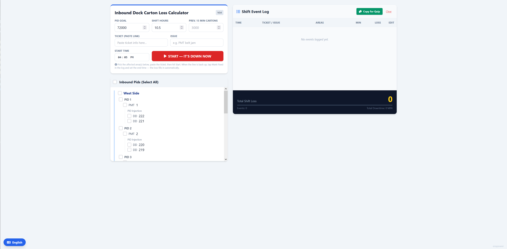
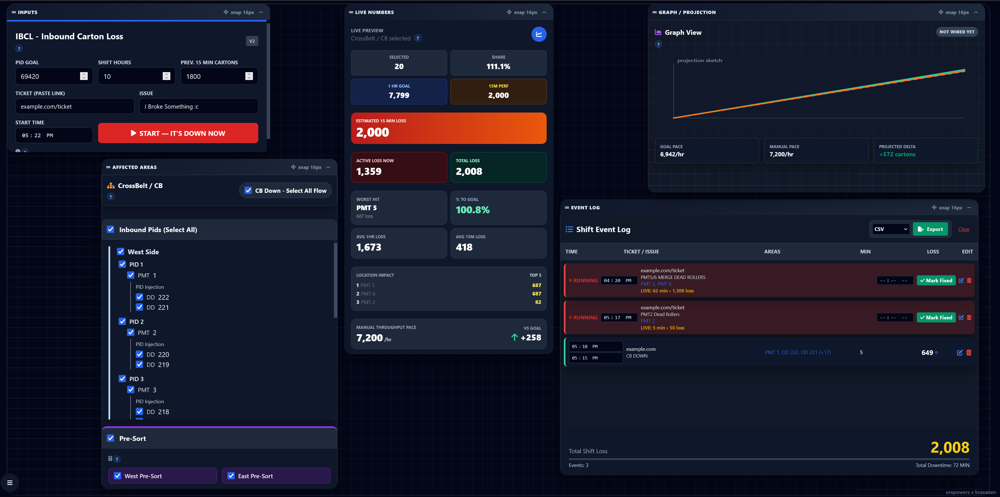

# IBCL (Inbound Carton Loss)

> **Module:** Flowin Operations Suite (FOS)
>
> **Version:** 2.0.0
>
> **Type:** Standalone Browser Application
>
> **Status:** Active Development

---

# Overview

IBCL (Inbound Carton Loss) is a browser-based operational dashboard developed to assist Inbound Flow Process Guides with documenting downtime events, estimating carton loss, monitoring throughput, and visualizing shift performance.

Unlike official operational reporting systems, IBCL focuses on providing rapid operational awareness using information already available to the operator during live operations.

The application operates entirely client-side and requires no installation or internet connection.

---

# Evolution

IBCL originated as a lightweight downtime calculator created by **erapower**.

Version 2 preserves the original operational calculations while expanding the application into a modular desktop-style dashboard featuring historical tracking, projection analytics, customizable layouts, localization, and export functionality.

## Before & After

| Original IBCL | IBCL Version 2 |
|:-------------:|:--------------:|
|  |  |

---

# Design Philosophy

IBCL prioritizes **operational awareness over perfect precision.**

The application exists to answer questions such as:

- How much are we currently losing?
- Which area is contributing the most?
- Are we still on pace to meet goal?
- What is our projected finish?
- Where should operational attention be focused?

Rather than attempting to replicate official reporting systems, IBCL uses user-provided operational data to generate consistent and transparent estimates.

---

# Core Components

## Downtime Tracking

IBCL supports documenting multiple simultaneous downtime events.

Supported equipment includes:

- CrossBelt
- PID hierarchy
- PMTs
- Dock Doors
- East Pre-Sort
- West Pre-Sort

CrossBelt automatically selects all downstream equipment to reduce repetitive input.

---

## Desktop Workspace

The interface is fully customizable.

Features include:

- Drag-and-drop cards
- Resize from every edge
- Minimize cards
- Pop-out windows
- Saved layouts
- Layout presets
- Multi-monitor support

---

## Performance Metrics

IBCL continuously calculates:

- Active carton loss
- Total carton loss
- Estimated processed cartons
- Goal comparison
- Percent to goal
- Worst impacted area
- Top impacted locations
- Average hourly loss
- Average 15-minute loss
- Estimated throughput

---

## Projection System

Version 2 introduces historical throughput tracking and future shift projections.

Current functionality includes:

- Historical throughput samples
- Shift-aware calculations
- Day/Night presets
- Overtime extension
- Configurable sample intervals
- Historical replay
- Goal projection
- Processed progress tracking
- Projected finish estimation

Future versions are intended to integrate live throughput sources while remaining compatible with manual workflows.

---

## Export

Shift history can be exported as:

- Clipboard
- CSV
- JSON
- Markdown

---

## Localization

Current languages:

- English
- Español
- Ελληνικά

Additional language packs can be added without modifying application logic.

---

# Data Storage

IBCL stores all information locally using browser Local Storage.

Examples include:

- Event history
- Projection history
- Throughput samples
- Workspace layouts
- User preferences
- Theme
- Language
- Personalization

---

# Privacy

IBCL is intentionally designed as a completely client-side application.

The application does not:

- Upload data
- Transmit operational information
- Collect analytics
- Require user accounts
- Communicate with external services

Information leaves the application only when the user explicitly exports or copies it.

---

# Security

IBCL contains:

- No credentials
- No authentication tokens
- No API keys
- No proprietary documentation
- No confidential datasets
- No embedded operational endpoints

Operational calculations are generalized estimation formulas based on user-provided information and publicly observable workflow.

The application is intended to improve productivity and operational awareness without exposing proprietary operational systems or business processes.

---

# Architecture

Development is performed using a modular source tree.

Production releases are compiled into a single standalone HTML application.

This provides:

- Easier maintenance
- Cleaner source code
- Portable deployment
- Offline operation

---

# Planned Enhancements

Framework already exists for:

- Live throughput ingestion
- Historical throughput replay
- Enhanced projection analytics
- Additional dashboard modules
- Expanded localization

Implementation is intentionally deferred until reliable and appropriate data sources become available.

---

# Credits

## Original Project

Original application concept, interface, and carton loss logic by **erapower**.

## Version 2

Architecture redesign, modular framework, desktop dashboard, localization, projection framework, export system, multi-monitor support, and ongoing development by **yung-megafone**.

---

# Related Documentation

- Repository README
- CHANGELOG.md
- RELEASE_NOTES.md
- LICENSE